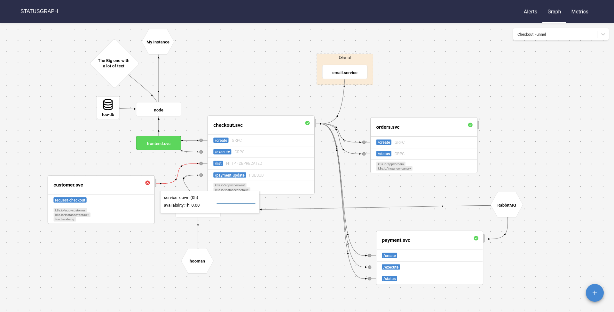

# Statusgraph
A status page for your distributed system.




## TLDR;

Try the UI (without colors):
```
$ docker run -it -p 8000:8000 quay.io/moolen/statusgraph:0.1.0 server
```

## Overview
This is a webapp that let's you visualize your system: create nodes and edges to draw your system architecture and signify dependencies. Annotate your services with Metrics and Alerts via `Prometheus` and `Alertmanager`.

Conceptually, you want to know if your service is "running", i.e. it is in a binary state: `red` lamp vs. `green` lamp.
This question is incredibly hard to answer. Statusgraph taks this approach: you define alerts via Prometheus which indicate a red/yellow lamp (service is dead / not available / has issues ..).
Additionally, you can map metrics

Alert Example:

```yaml
- alert: service_down
    expr: up == 0
    labels:
      severity: critical
      service_id: "{{ $labels.service_id }}" # this is known at alert-time
    annotations:
      description: Service {{ $labels.instance }} is unavailable.
      runbook: "http://example.com/foobar"
```

## Requirements
* alertmanager v0.20.0 and above
* prometheus

## use-cases

You can visualize many different aspects of your environment.
* 10.000ft view of your distributed system
* self-contained system of a single team (a bunch of services, databases)
* network aspects: CDN, DNS & Edge services
* end-user view: edge services, blackbox tests
* Data engineering pipeline: visualize DAGs / ETL Metrics

## Components
## Server
* communicates with prometheus to map metrics to a particular service (think: availability, error rate)
* asks alertmanager for active alerts

### Server Configuration
* contains the configuration for upstream
* contains the mapping for alerts and metrics

```yaml
upstream:
  prometheus:
    url: http://localhost:9090
  alertmanager:
    url: http://localhost:9093

mapping:
  # this defines how we select alerts to display
  # use a `labelSelector` to filter
  # and `map` to specify the lookup key in the alert struct
  alerts:
    label_selector:
      - severity: "critical"
      - severity: "warning"
        important: "true"

    # red & green lamp indicator
    # Use this if your alerts use a specific label for a service (e.g. app=frontend / app=backend ...)
    # this tells statusgraph to map alerts to nodes using the following labels/annotations
    service_labels:
      - "service_id"
    service_annotations:
      - "statusgraph-node"

  metrics:

    # green lamp indicator!
    # this helps statusgraph to find all existing services by fetching the label values
    # reference: https://prometheus.io/docs/prometheus/latest/querying/api/#querying-label-values
    service_labels:
      - 'service_id'

    queries:
      # just as an example
      - name: cpu wait
        query: sum(rate(node_pressure_cpu_waiting_seconds_total[1m])) by (service_id) * 100
        service_label: service_id
```

## Roadmap
#### graph import & streaming
* i want to import the graph configuration from different file formats (plantuml, dot..)
* right now the graph configuration is static. This works for a logical representation. But computing environments are very dynamic, so
 i want to stream the graph configuration via an API
  * do we need a hybrid approach? (cluster per dynamic-api AND static config?)
  * which upstream API to spike? How do we determine the edges? kubernetes/$CLOUD?
  * can we use traces (L3/4: tcp/udp/ip via eBPF, L7 via opentracing?) to determine the nodes and edges?

#### further customization
* as a user i want to cross-reference other services (e.g. grafana) from the tooltip (e.g. link to dashboard, runbook etc.)

## TODO

* [x] add direction arrow to edge
* [x] highlight adjacent nodes & edges
* [ ] graph-config library
  * implement config library with shapes, consider using draw.io shapes (AWS/GCP..)
* [ ] Misc. optimizations
  * metrics & alerts caching
  * decouple client and upstream requests

## Developing

Run Server

```
$ make binary
$ ./bin/statusgraph server --config ./config.yaml
```

Run Test Infra

```
$ cd hack
$ docker-compose up  -d

# test failure
$ docker-compose stop cart.svc
```

Run Client

```
$ cd client; npm install; npm run watch
```

You can access prometheus via `localhost:9090`, alertmanager via `localhost:9093` and the backend (which serves the SPA too) via `localhost:8000`.
